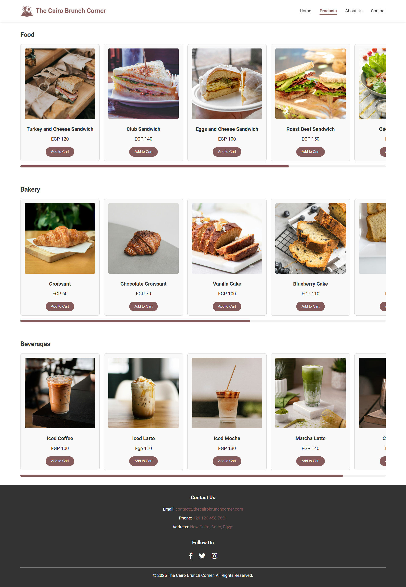

<h1 align="center">The Cairo Brunch Corner Example Website</h1>

The Cairo Brunch Corner is more than just a shop — it’s a community-driven space built around a shared love for exceptional food. We specialize in a curated selection of fresh, organic, and artisanal products sourced from trusted local and international suppliers.

Founded in **2025**, our mission is to bring people together through great food. Whether you're stopping by for a quick bite or taking home ingredients for a home-cooked meal, everything we offer is selected with care, passion, and a commitment to sustainability.

We believe that every product has a story, and we’re proud to support producers who share our values. Thank you for choosing to be part of our journey — your support helps us continue our mission to celebrate real food and build lasting connections.


---

## Features

- **Home Page**: A welcoming landing page that introduces our brand and offerings.
- **Products Page**: A curated gallery of our high-quality brunch items.
- **About Us Page**: Our journey, values, and commitment to community and sustainability.
- **Contact Page**: A contact form and direct details to get in touch.
- **Responsive Design**: Fully responsive layout for mobile, tablet, and desktop.

---

## Project Structure

```plaintext
.
├── assets/
│   ├── icons/         # Logo files
│   └── images/        # Images used throughout the site
├── css/
│   └── style.css      # Custom styles for the entire website
├── index.html         # Homepage
├── products.html      # Menu or product showcase
├── about.html         # The "Our Story" page
├── contact.html       # Contact form and contact details
└── README.md          # This documentation file
````

---

## Technologies Used

* **HTML5**: Semantic and accessible structure
* **CSS3**: Clean, responsive styling with custom palettes
* **Font Awesome**: Icons for footer and contact links
* **Google Fonts**: Uses *Roboto* for modern typography

---

## Getting Started

To run the project locally:

```bash
git clone https://github.com/yassinshebl/the_cairo_brunch_corner_example_website
```

Then, open `index.html` file in your browser — no server setup required.

---

## Screenshots
### Home Page:

### Products Page:

### About Us Page:

### Contact Page:


---
<h1 align="center">Proudly Made in Egypt❤️</h1>

