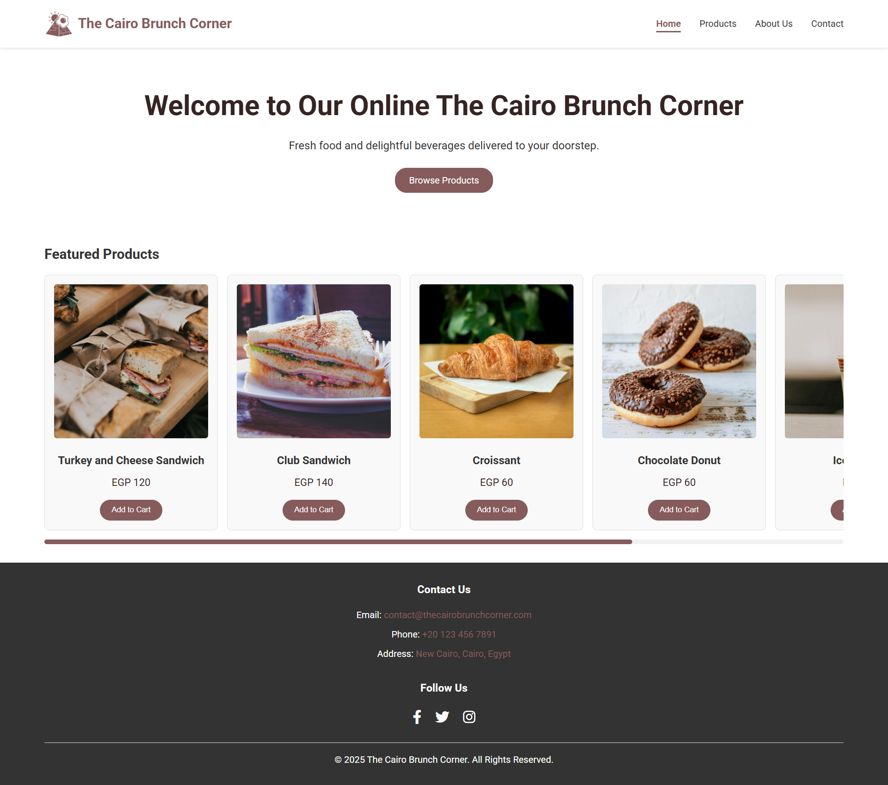
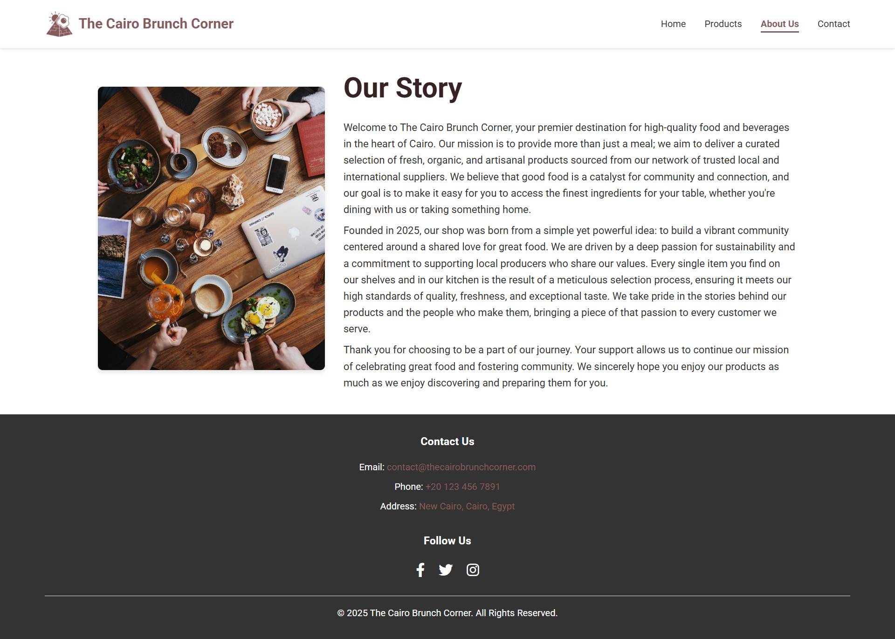
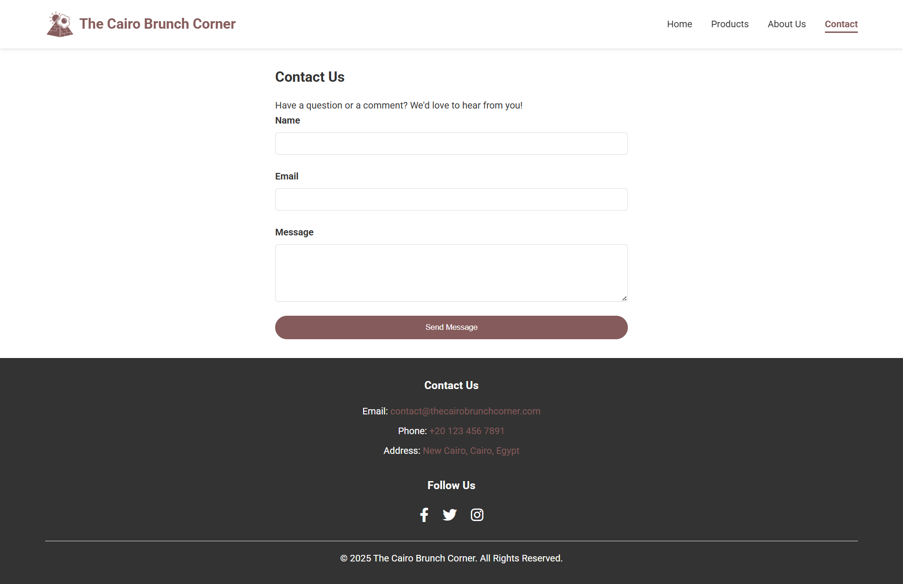

# 🥐 The Cairo Brunch Corner

Welcome to the official GitHub repository for **The Cairo Brunch Corner** — a static website that reflects our love for brunch culture in the heart of Cairo. This site showcases our mission, our unique products, and provides an easy way for customers to connect with us.

---

## 🌟 Features

- **Home Page** – A welcoming landing page that introduces our brand and offerings.
- **Products Page** – A curated gallery of our high-quality brunch items.
- **About Us Page** – Our journey, values, and commitment to community and sustainability.
- **Contact Page** – A contact form and direct details to get in touch.
- **Responsive Design** – Fully responsive layout for mobile, tablet, and desktop.

---

## 📁 Project Structure

```plaintext
.
├── assets/
│   ├── icons/         # Logo and favicon files
│   └── images/        # Images used throughout the site
├── css/
│   └── style.css      # Custom styles for the entire website
├── index.html         # Homepage
├── products.html      # Menu or product showcase
├── about.html         # The "Our Story" page
├── contact.html       # Contact form and contact details
└── README.md          # This documentation file
````

---

## 🛠️ Technologies Used

* **HTML5** – Semantic and accessible structure
* **CSS3** – Clean, responsive styling with custom palettes
* **Font Awesome** – Icons for footer and contact links
* **Google Fonts** – Uses *Roboto* for modern typography

---

## 🚀 Getting Started

To run the project locally:

```bash
git clone https://github.com/your-username/your-repository-name.git
```

Then, open any of the `.html` files in your browser — no server setup required.

---

## 🌐 Live Demo

A live version of the site is available here:
**[🔗 Visit The Cairo Brunch Corner](#)**
*(Replace with actual deployed URL once available.)*

---

## 🤝 Contributing

We welcome contributions to improve the site!

1. Fork the repository
2. Create a new branch:
   `git checkout -b feature/your-feature-name`
3. Commit your changes:
   `git commit -m "feat: Add feature"`
4. Push to your fork:
   `git push origin feature/your-feature-name`
5. Open a Pull Request on GitHub

---

## 📄 License

This project is licensed under the **MIT License**.
See the [LICENSE](./LICENSE) file for more information.

---

## 📷 Screenshots







---

> Created with 💛 in Cairo
